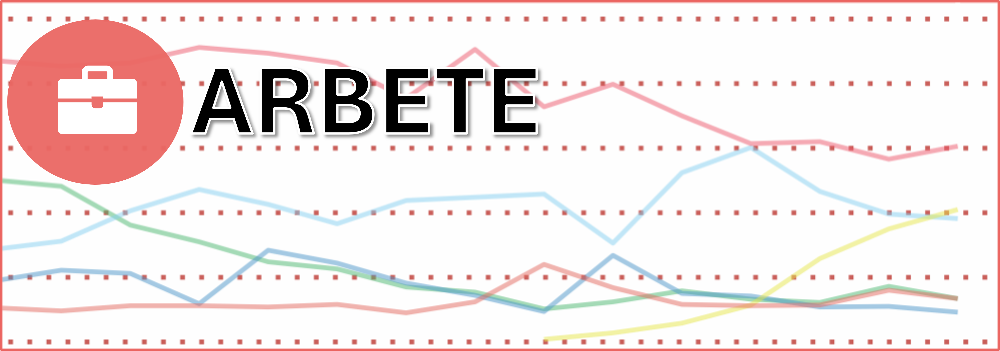

```{r setup, include=FALSE}
library(flexdashboard)
library(ggplot2)
library(stringr)
library(scales)
library(dplyr)
library(tidyr)
library(DT)
library(png)
library(data.table)
library(magrittr)
library(gridExtra)
library(openxlsx)
library(patchwork)
library(ggthemes)
library(plotly)
library(ggridges)
library(forecast)
library(GGally)
library(cluster)
library(sf)
```


## {data-height=250 .tabset .tabset-pills}

### Om initiativet
*Svensk statistik* är ett initiativ med det huvudsakliga syftet att visualisera utvecklingen i Sverige utifrån ett antal parametrar. Genom SCB är Sverige ett land som ligger i framkant i att lagra registerdata och föra annan statistik på befolkningsnivå, men denna statistik är inte alltid så enkel att ta till sig. Detta är ett försök att förenkla möjligheten att ta till sig av denna data.


## {data-height=375 .tabset .tabset-pills}

### Områden
Dessa teman finns rapporter att fördjupa sig inom:
<br>
<br>
- **Demokrati**: Partisympatier, valresultat, valdeltagande och politiskt engagemang.
<br>
- **Arbete**: Anställning, arbetstid, frånvaro från arbete och löner.
<br>
- **Livsstil**: Välbefinnande, hälsa, rökning/snusning och trygghet.
<br>
<br>
För att komma åt en rapport, **klicka nedan!**

## {data-height=375}
###

<a href="https://lindw3.github.io/svenskstatistik-demokrati/">
```{r, echo=FALSE, out.width = "100%", out.height = "100%"}


```
</a>


###

<a href="https://lindw3.github.io/svenskstatistik-arbete/">
```{r, echo=FALSE, out.width = "100%", out.height = "100%"}

```
</a>

###

<a href="https://lindw3.github.io/svenskstatistik-livsstil/">
```{r, echo=FALSE, out.width = "100%", out.height = "100%"}

```
</a>
